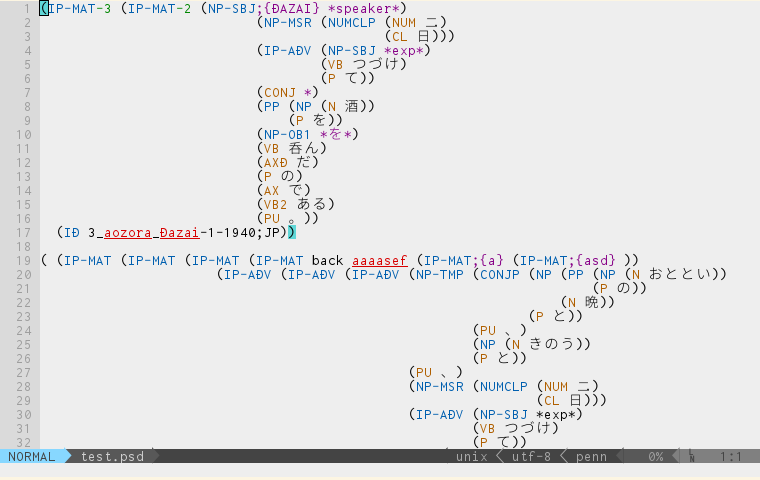

# penn.vim
penn.vim is an editorial environment for linguistic annotations in penn-treebank style, working in Vim / Neovim.
This plugin provides the following features:

- Syntax highlight scheme
- Key mappings

## Installation
Put the plugin folder in your .vim directory, or use plugin managers.
Enable the filetype detection, plugin and indent (by the command `:filetype plugin indent on`)

## Syntax Highliting
| Type | Highlight Group | Examples | 
|:--------|:-------:|:-----------|
| Non-terminal nodes | Label | NP, VP |
| Ill-formed non-terminal nodes | Error| ADA, VI{J%$#KLSDF  adjkds}sad |
| Terminal nodes | Constant | N, V |
| Dislocation indices | Identifier | NP-1, VP-2 |
| Auxiliaries | Special |  N;{additional info}, \*pro\* |
| Comments | Comment | (COMMENT {commentcommentcomment....})|

### Sample
 
in [Lucius Light High Constrast color scheme](https://github.com/jonathanfilip/vim-lucius)
 
## Default Key Mappings
| Key        | Type | Function Name | Function | 
|:--------|:-------:|:-----------|-----------|
|`an` (**a**ll of the **n**ode)| Visual, Operator | `<plug> *****` | select all the node |
|`in` (the **i**nside of the **n**ode)|  Visual, Operator | `<plug> *****` | select all of the child node(s) |
|`as` (**a**ll of the **s**entence)| Visual, Operator | `<plug> *****` | select the root node |
|`is` (the **i**nside of the **s**entence)|  Visual, Operator | `<plug> *****` | select all of the node(s) immediately dominated by the root|
|(unimplemented) `nn` (the **n**ext node) | Visual | `<plug> *****` | capture the next sister node |
|`NN` | Visual | `<plug> *****` | capture the previous sister node |
|(unimplemented) `<LocalLeader>wn`? | Normal, Operator, Visual | | go to the beginning of the next sister node |
|(unimplemented) `<LocalLeader>en`? | Normal, Operator, Visual | | go to the end of the current node |
|(unimplemented) `<LocalLeader>bn`? | Normal, Operator, Visual | | go to the beginning of the current node |
|(unimplemented) `<LocalLeader>gen`? | Normal, Operator, Visual | | go to the end of the previous node |

### Examples of Usage
- `van`: select the whole node in Visual mode
- `"+yin`: yank all the child node(s) to the sytem clipboard
- `d2an`: delete the node immediately dominating the currently selected node in Visual mode

__The motions / text objects `an`, `in`, `nn` and `NN` can be used recursively.__

## Getting involved
The author welcomes any contributions for this Vim / Neovim plugin by reporting bugs, creating issues or making pull requests.

The current tasks:
- Refactoring of the codes using `searchpairpos()`
- Implementation of new features

## License
See `LINCENSE`.
